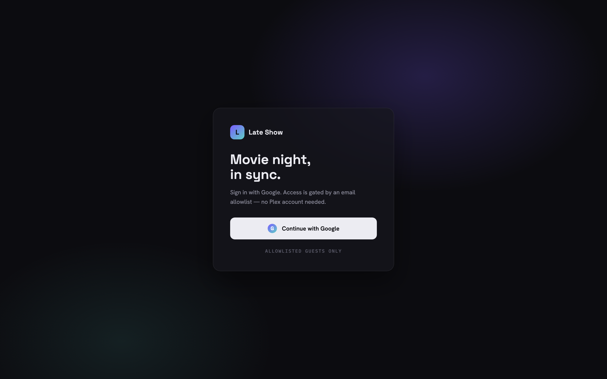
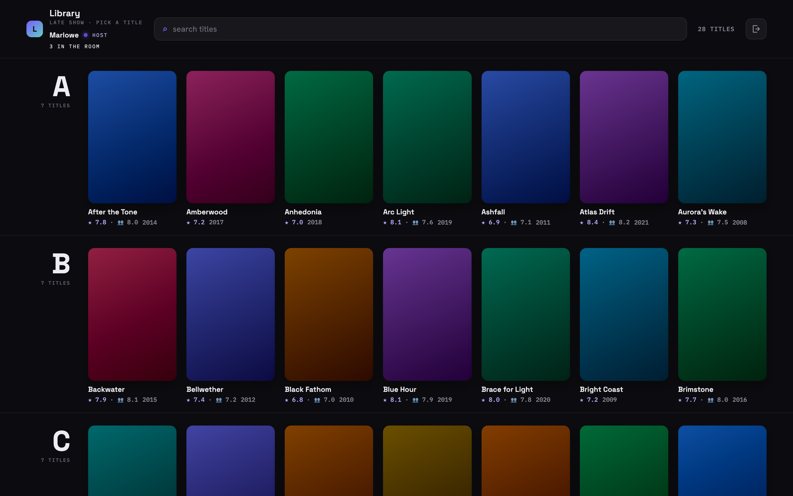
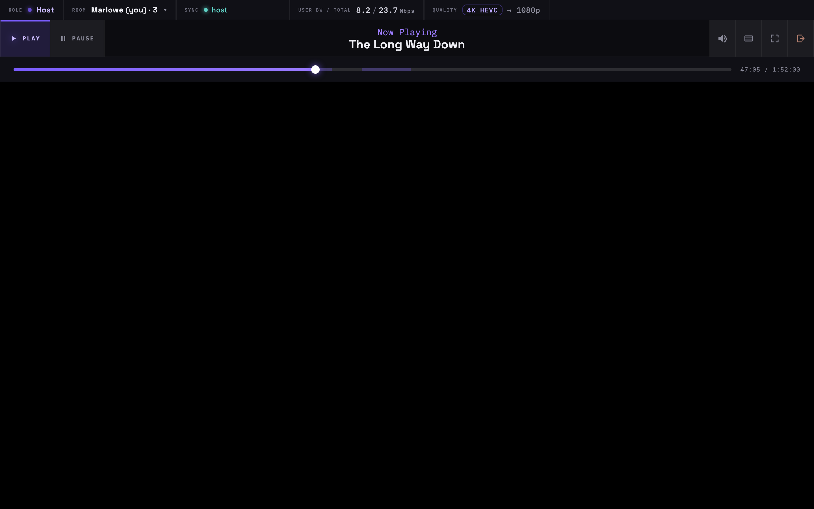
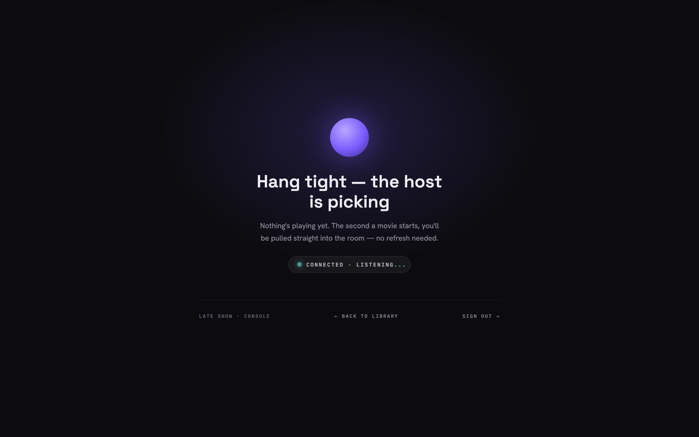
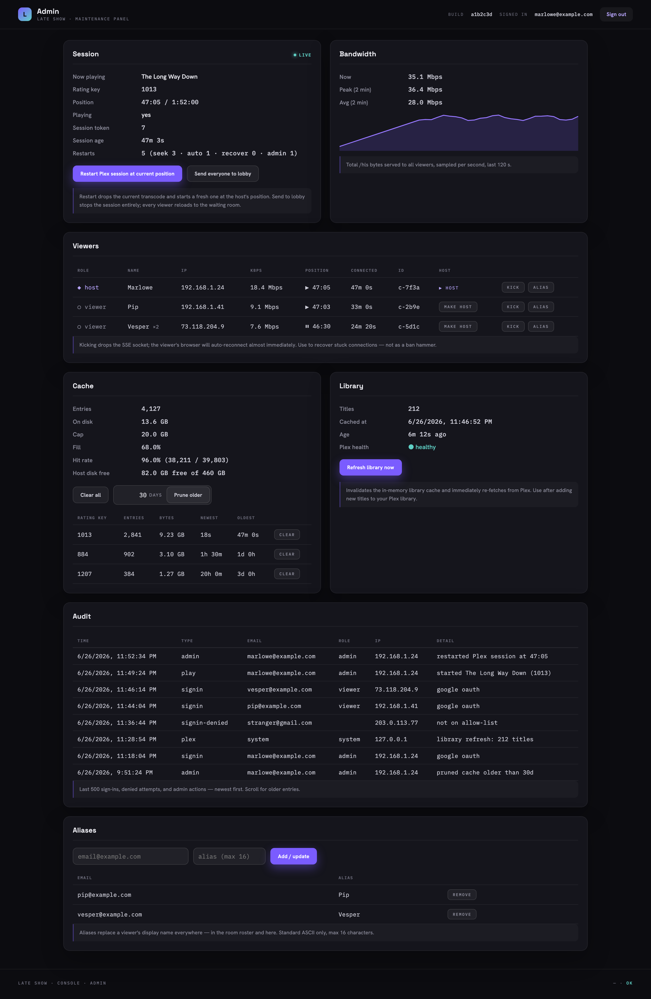

# plex-watchparty

[](https://github.com/rawsocket-dev/plex-watchparty/actions/workflows/ci.yml)
[](LICENSE)

Restream a single movie from Plex and watch it **in sync** with friends who
**sign in with Google** (an email allowlist controls who gets in) — no Plex account needed.

The Plex token never leaves the server. The watchparty proxy acts as a thin
caching layer over Plex's Universal Transcoder, fetching HLS segments on demand
and caching them to disk so backward seek is instant. Friends stay in sync via
Server-Sent Events — the host's play/pause/seek actions are broadcast to all
viewers.

> **Built with AI.** This project — the Go server, the web UI, and these docs —
> was written largely with AI coding assistance, under human direction and review.

## Screenshots

> Rendered against placeholder data — no real Plex library or accounts.

**Sign in** — Google sign-in, gated by an email allowlist.



**The library** — the active host browses and picks tonight's title.



**The player** — synced hls.js playback with a scrub bar, cached-range
markers, a live room roster, and per-viewer bandwidth.



**The waiting room** — shown between movies, with a "resume where you left
off" prompt and a recently-screened reel.



**The admin console** — live session, room bandwidth, viewer roster, segment
cache, library health, audit log, and display aliases.



## How it works

The watchparty server acts as a thin proxy + cache over Plex's Universal
Transcoder HLS output. When the host picks a movie, watchparty asks Plex to
start a transcode session at the requested offset. Plex produces HLS segments;
watchparty fetches the playlist on demand, rewrites segment URLs to route
through us, and caches fetched segments to disk so backward seek into a
previously-watched range is instant.

On forward seek past Plex's current transcoded position, watchparty restarts
Plex's transcoder at the new offset. Clients see a brief ~5-second pause (Plex
transcoder spin-up) and then playback resumes at the new position.

Friends watching together stay in sync via Server-Sent Events: the host's play
/ pause / seek actions are broadcast to all viewers, who track the host's
authoritative position with sub-second tolerance.

Playback state (last movie + position) is persisted to disk, so after a
container restart or idle shutdown the library and waiting room offer to
**resume where you left off**, and the **active host** is restored so the
same person keeps the remote (their browser reconnects and reclaims it).
There's no database — live state is in memory; only the segment cache, the
library cache, the recently-played list (`recent.json`), the resume hint +
active host (`state.json` / `host.json`), the admin audit log
(`audit.jsonl`), and admin-assigned display aliases (`aliases.json`)
survive on disk.

**Code structure** — the Go sources are one `package main` under `cmd/plexwatchparty/`:

- `main.go` — HTTP routing, env parsing, wiring
- `plex.go` — Plex API: list movies, start transcodes, health-state machine
- `plex_session.go` — one active Plex transcode session
- `playlist.go` — HLS playlist rewriter + segment-context encoding
- `cache.go` — LRU disk cache for HLS segments (survives restarts)
- `sync.go` — authoritative playback state, SSE broadcast, host control endpoint
- `state.go` — persisted resume hint (last movie + position)
- `host.go` — persisted active host (restored across restarts)
- `recent.go` — persisted recently-played list
- `bandwidth.go` — per-IP rolling-window bandwidth tracker
- `auth.go` — Google OAuth gate, HMAC session cookies, role gating
- `oauth.go` — Google sign-in flow
- `admin.go` — `/admin` maintenance console + JSON API
- `web/` — login, library, waiting room, drift-correcting hls.js player, admin panel

Read the playlist / segment / cache files (`plex.go`, `playlist.go`,
`cache.go`) first if you're modifying that pipeline.

**A note on Plex TLS:** Plex Media Server's certificate is signed for
`*.<machine-id>.plex.direct` (Plex.tv's auto-issued cert). Any operator
who fronts Plex with their own DNS name fails standard verification, so
watchparty uses an HTTP client with `InsecureSkipVerify` enabled for
**Plex calls only** (browser-facing TLS is unaffected). Traffic is
LAN-side and the X-Plex-Token query param is the real authentication
surface — the cert check would add no security in practice.

## Run with Docker (recommended)

```sh
# Clone and enter the repo.
git clone https://github.com/rawsocket-dev/plex-watchparty.git
cd plex-watchparty

# 1. Copy the env template and fill in your Plex token, Google OAuth
#    credentials, and email allowlists.
cp .env.example .env
$EDITOR .env

# 2a. Pull the pre-built multi-arch image and start in the background:
docker compose pull
docker compose up -d

# 2b. ...or build from source instead (same compose file):
docker compose up --build
```

Then open `http://<your-host>:8080`, sign in with Google, and pick a movie.

All configuration lives in `.env` — the compose file consumes it via
`env_file`, so adding or changing a setting is just a line in `.env` (no
compose edits). Every variable, with docs, is in `.env.example`.

The pre-built image is published to this repo's GitHub Container Registry on
every push to `master` (multi-arch amd64 + arm64) at
`ghcr.io/rawsocket-dev/plex-watchparty:latest`. It's public, so `docker
compose pull` needs no `docker login`. If you'd rather not pull, `docker
compose up --build` builds the same image from the local `Dockerfile`.

> Set `PLEX_BASE_URL` in `.env` if Plex isn't reachable at
> `host.docker.internal:32400`.

## Run locally

```sh
PLEX_BASE_URL=http://192.168.1.10:32400 PLEX_TOKEN=xxx \
GOOGLE_CLIENT_ID=xxx GOOGLE_CLIENT_SECRET=xxx \
GOOGLE_REDIRECT_URL=http://localhost:8080/oauth/callback \
ALLOWED_EMAILS=you@example.com go run ./cmd/plexwatchparty
```

## Configuration

| Env var                           | Required | Default                  | Notes |
|-----------------------------------|----------|--------------------------|-------|
| `PLEX_BASE_URL`                   | yes      | —                        | Your Plex server URL, e.g. `http://192.168.1.10:32400` |
| `PLEX_TOKEN`                      | yes      | —                        | Plex auth token (stays server-side, never sent to clients) |
| `GOOGLE_CLIENT_ID`                | yes      | —                        | Google OAuth 2.0 client ID (Web application type). |
| `GOOGLE_CLIENT_SECRET`            | yes      | —                        | Matching client secret. Also seeds the session-cookie HMAC (rotating it signs everyone out). |
| `GOOGLE_REDIRECT_URL`             | yes      | —                        | `https://<host>/oauth/callback`, registered as an authorized redirect URI on the OAuth client. |
| `ALLOWED_EMAILS`                  | yes      | —                        | Comma-separated emails that may sign in & watch. |
| `HOST_EMAILS`                     | no       | empty (= everyone allowed can drive) | Subset that can pick / play / pause / seek. |
| `ADMIN_EMAILS`                    | no       | empty (= no one)         | Subset that can open the `/admin` maintenance panel. |
| `PLEX_TRANSCODE_BITRATE_KBPS`     | no       | `12000` (12 Mbps)        | Plex Universal Transcoder target bitrate in kbps. Every play goes through Plex's transcoder (1920×1080 H.264 + AAC) — there is no direct-stream mode. Plex handles codec / HDR conversion (HEVC→H.264, HDR→SDR). |
| `CACHE_MAX_GB`                    | no       | `20`                     | Disk cap for HLS segment cache in GB. Cached segments survive restarts; LRU eviction kicks in when cap is hit. Estimate ~10 GB per typical 2hr movie at 12 Mbps. |
| `LISTEN_ADDR`                     | no       | `:8080`                  | Listen address (e.g., `:8080` or `0.0.0.0:8080`) |
| `WORK_DIR`                        | no       | `$TMPDIR/plexwatchparty` | Root data directory for cache and work files |
| `TRUSTED_PROXY_CIDRS`             | no       | loopback + RFC1918 + ULA | Comma-separated CIDRs whose peers may set `X-Forwarded-For` / `X-Real-IP`. Headers from any other peer are ignored (so a directly-reachable client can't spoof its attribution). Widen this only if your reverse proxy sits on a public address. |
| `DISCORD_WEBHOOK_URL`             | no       | —                        | Discord incoming-webhook URL. When set, the server posts a rich embed when a movie starts, stops, pauses, or resumes. Unset → feature off. |
| `PUBLIC_BASE_URL`                 | no       | origin of `GOOGLE_REDIRECT_URL` | Public origin used to build poster-image links in Discord embeds, e.g. `https://watch.example.com`. Enabling the webhook serves an **unauthenticated, read-only** `/poster/<ratingKey>.jpg` route that streams Plex poster art (token never exposed) so Discord can render the thumbnail. If no absolute origin can be resolved, embeds post without a poster. |

**Roles:**

Everyone in `ALLOWED_EMAILS` can sign in and watch (*viewer*). `HOST_EMAILS`
lists who *may* drive, but at any moment exactly one of them — the **active
host** — actually holds the controls (pick / play / pause / seek). The first
eligible person to join becomes the active host; if they leave, control passes
to a random remaining eligible viewer. An admin can reassign the active host
from the `/admin` roster, and the current host can "pass the remote" to another
viewer from the player; everyone else sees a **Host** indicator of who's
driving. If `HOST_EMAILS` is empty, every signed-in user is eligible. Anyone in
`ADMIN_EMAILS` can open the `/admin` maintenance panel after signing in.

[Finding your Plex token.](https://support.plex.tv/articles/204059436-finding-an-authentication-token-x-plex-token/)

## Admin panel (`/admin`)

A small maintenance console available to anyone in `ADMIN_EMAILS` after
signing in. The panel covers: current Plex session info + manual restart or
send-everyone-to-lobby, a live room-bandwidth sparkline, segment cache stats
with clear-all / clear-one-movie / prune-older-than-N-days, library cache age
+ manual refresh, and a live SSE viewer roster (kick a stuck connection or
reassign the active host). An **Aliases** section maps a viewer's email to a
display name that overrides their Google name in every roster — in the room
and here. The panel also shows an **Audit** log — the last 500 sign-ins, denied sign-in
attempts, admin actions, playback events (load / play / pause / seek / stop,
attributed to the host), and Plex lifecycle events (server reachability + idle
shutdown, recorded as `system`). Persisted to `audit.jsonl`.

### Google Cloud setup

One OAuth client covers the entire app (sign-in for all users, not just admins).

1. Go to the [Google Cloud Console](https://console.cloud.google.com/),
   create (or pick) a project.
2. **APIs & Services → Credentials → Create credentials → OAuth client ID.**
3. Application type: **Web application**. Add the deployed callback URL
   under *Authorized redirect URIs*:
   `https://watch.example.com/oauth/callback`. (For local dev you can
   add `http://localhost:8080/oauth/callback` too.)
4. Save. Google shows you the **Client ID** and **Client secret**.
5. **APIs & Services → OAuth consent screen.** Pick *External* (or
   *Internal* if you're on Google Workspace). Fill in the basic app info
   (app name, support email, developer contact); the `openid`, `email`,
   and `profile` scopes are automatically included.
6. Set the env vars on the watchparty container:

   ```
   GOOGLE_CLIENT_ID=…apps.googleusercontent.com
   GOOGLE_CLIENT_SECRET=…
   GOOGLE_REDIRECT_URL=https://watch.example.com/oauth/callback
   ALLOWED_EMAILS=you@example.com,friend@example.com
   HOST_EMAILS=you@example.com
   ADMIN_EMAILS=you@example.com
   ```

> **Publishing note:** The app requests only non-sensitive scopes
> (`openid`, `email`, `profile`), so Google's app-verification review
> is NOT required and there is no test-users list to maintain. In the
> OAuth consent screen, set Publishing status to **"In production"
> ("Publish app")** — any Google account can then complete sign-in, and
> `ALLOWED_EMAILS` is the real gate (non-allowlisted users are bounced
> after authenticating). Fill the basic consent-screen fields once (app
> name, support email, developer contact). (Alternatively, a Google
> Workspace domain you control can use User Type "Internal" — org-only,
> no publishing.)

## Reverse proxy

The app speaks plain HTTP and is designed to sit behind your existing TLS
terminator. It honors `X-Forwarded-For` / `X-Real-IP` for bandwidth + viewer
attribution, and the SSE handler ships `X-Accel-Buffering: no` so nginx-family
proxies don't buffer events. Mount it at the root of a hostname — paths
like `/hls/`, `/events`, `/control` are absolute, so a `/watchparty/` subpath
won't work without a path-stripping rewrite.

Two knobs matter on every proxy: keep `proxy_read_timeout` generous (the first
HLS segment can take 1–6 s while Plex spins up its transcoder), and use
HTTP/1.1 with an empty `Connection` header for the SSE stream.

### nginx

```nginx
server {
    listen 443 ssl http2;
    server_name watchparty.example.com;
    # ssl_certificate / ssl_certificate_key ...

    location / {
        proxy_pass http://127.0.0.1:8080;   # the watchparty container
        proxy_http_version 1.1;
        proxy_set_header Host              $host;
        proxy_set_header X-Real-IP         $remote_addr;
        proxy_set_header X-Forwarded-For   $proxy_add_x_forwarded_for;
        proxy_set_header X-Forwarded-Proto $scheme;
        proxy_set_header Connection        "";

        # First-segment Plex transcodes can take several seconds.
        proxy_read_timeout 300s;
        # Belt-and-suspenders with X-Accel-Buffering: no on /events.
        proxy_buffering off;
    }
}
```

### Caddy

```caddy
watchparty.example.com {
    reverse_proxy 127.0.0.1:8080 {
        transport http {
            read_timeout 5m
        }
    }
}
```

Caddy auto-provisions TLS, sets the X-Forwarded-* headers, and handles HTTP/1.1
+ `Connection` correctly out of the box — no extra configuration needed for
SSE or HLS streaming.

### Traefik (Docker labels)

Add these labels to the `watchparty` service in `docker-compose.yml`:

```yaml
labels:
  - "traefik.enable=true"
  - "traefik.http.routers.watchparty.rule=Host(`watchparty.example.com`)"
  - "traefik.http.routers.watchparty.entrypoints=websecure"
  - "traefik.http.routers.watchparty.tls.certresolver=letsencrypt"
  - "traefik.http.services.watchparty.loadbalancer.server.port=8080"
  # Long-running responses (HLS + SSE) need generous timeouts.
  - "traefik.http.services.watchparty.loadbalancer.responseforwarding.flushinterval=100ms"
```

And in your Traefik static config (`traefik.yml`):

```yaml
serversTransport:
  forwardingTimeouts:
    responseHeaderTimeout: 300s
    idleConnTimeout: 300s
```

## Known limitations

- Seeking far ahead before Plex has transcoded to that position will pause for
  ~5 seconds while Plex spins up a new transcoder at the target offset.
- Firefox has weak HEVC support; H.265 titles play best in Safari/Chrome.
- No HTTPS — put it behind a reverse proxy if exposing beyond the LAN.

## License

[MIT](LICENSE).
